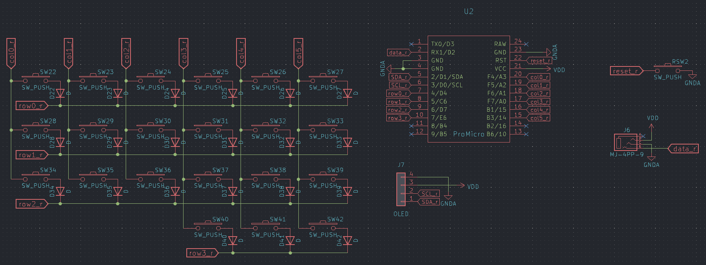
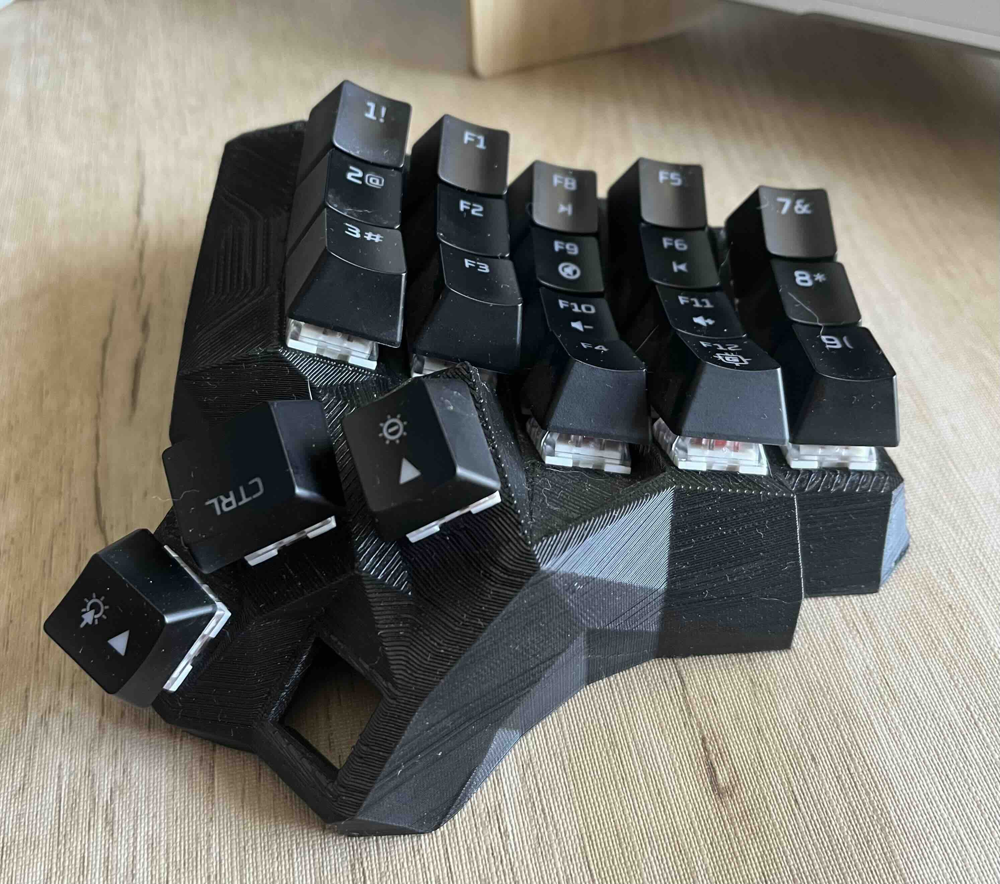
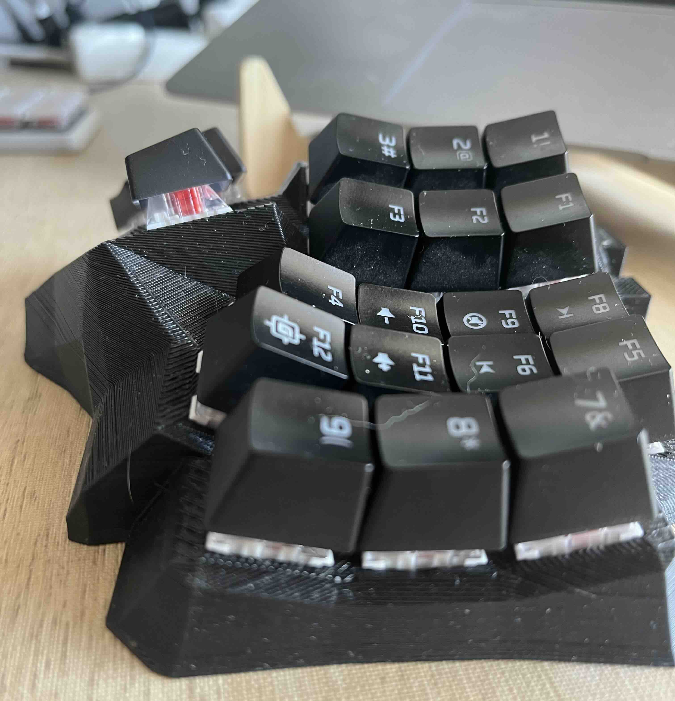
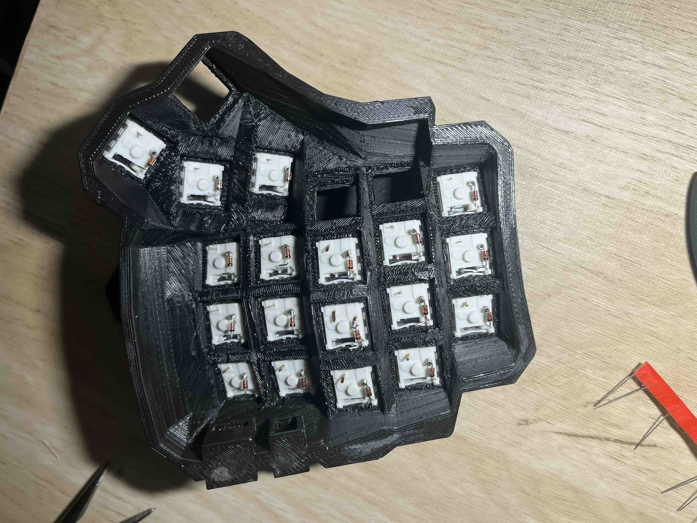
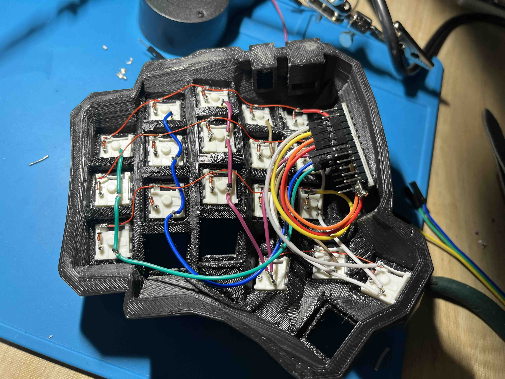
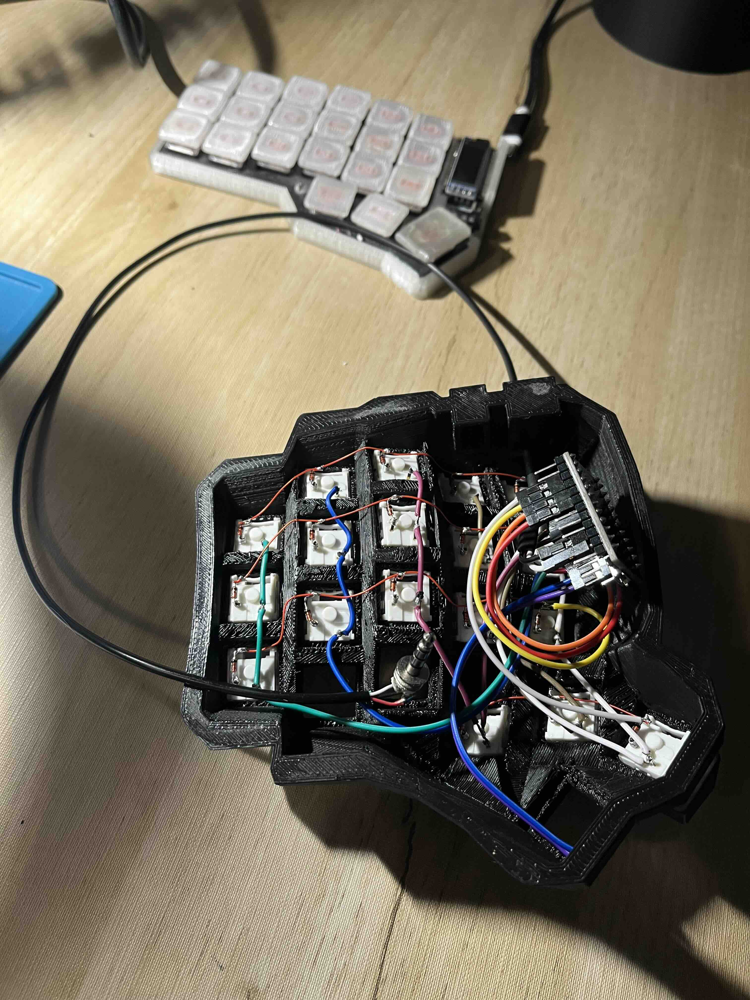
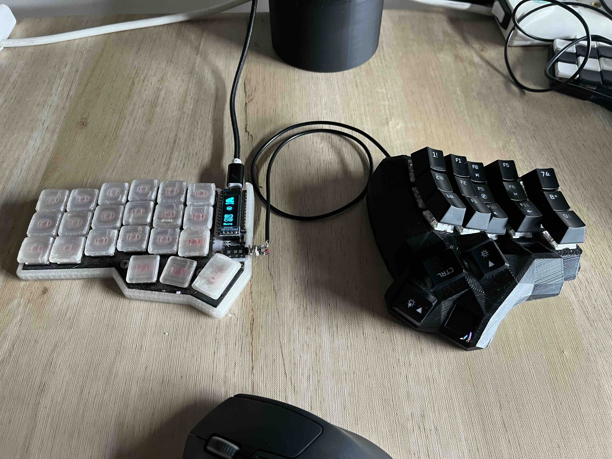

# dacty-manuform-box-oem
A dactyl manuform mechanical keyboard with kailh box switches and OEM keycups.

## Construction

### 3D model
This is the [STL right](docs/manuform-case-right-2021.08.02-04.55.21.stl), which was generated from
  [here](https://dactyl.mbugert.de/manuform).

This is for Kailh Choc switches, but as I already have it printed I use is with Kailh Box switches.

### PCB (just schematic)
Just to keep track of the switches wiring, I'm using the Kicad [corne-light](pcb/corne-light.kicad_sch) schematic copied
from the [foostan crkbd repo](https://github.com/foostan/crkbd).

### Building

To avoid the discontinuity of the keycup OEM profile, I used just the keycups from the numbers row
and the Fn (etc.) row.

Diodes are placed in the `COL2ROW` configuration, as it's seen in the schematic.

Key wiring.

I added a 3-wires cable for the serial communication between split parts.

Finally, the dactyl manuform box oem connected to the corne chocolate.

